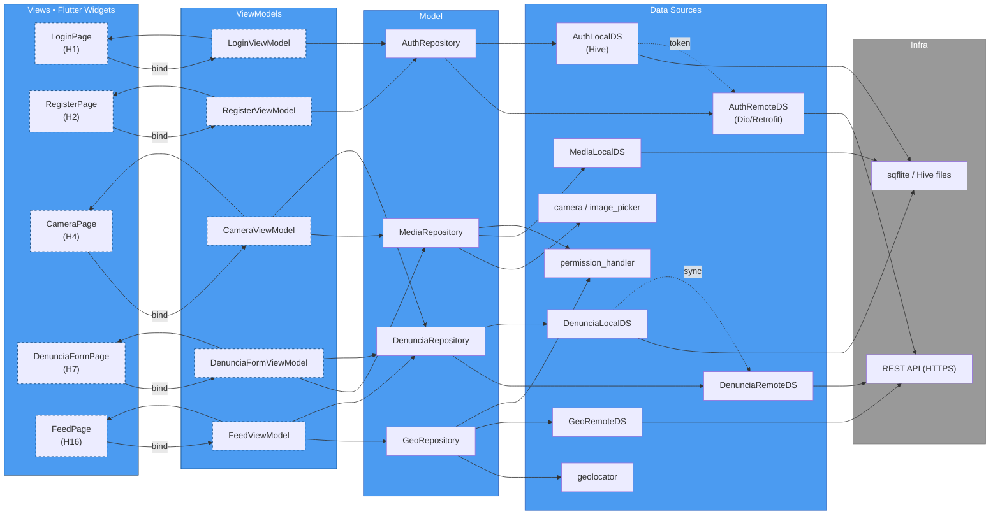

---

### Views

As **Views** representam a interface do usuário do sistema. No nosso caso, as Views são as **telas e componentes visuais do aplicativo mobile**, implementadas usando **Flutter Widgets**. Elas são responsáveis por exibir informações e capturar interações do usuário, funcionando como a "cara" do aplicativo. As Views observam e reagem a mudanças de estado fornecidas pelos seus respectivos ViewModels, garantindo uma UI dinâmica e responsiva.

---

### ViewModels

Os **ViewModels** são o elo entre a interface (Views) e a lógica de negócio (Model). Eles contêm o **estado da UI e a lógica de apresentação**, transformando os dados do Model em um formato que a View pode facilmente consumir. Utilizando gerenciadores de estado como **Provider** ou **Riverpod**, os ViewModels expõem dados reativos e métodos que as Views chamam em resposta a ações do usuário. Isso desacopla a View da complexidade do Model.

---

### Model

O **Model**, na nossa arquitetura, é materializado pelos **Repositories**. Cada Repository é uma camada de abstração que **define as operações de dados** para uma entidade específica (ex: usuários, denúncias, mídias). Eles atuam como coordenadores, ocultando a complexidade da origem dos dados (seja local ou remota) e oferecendo uma interface limpa e consistente aos ViewModels. Os Repositories são a única parte do Model com a qual os ViewModels interagem diretamente.

---

### Data Sources

As **Data Sources** são os **componentes que realmente executam as operações de acesso e persistência de dados**. Elas são especializadas: temos Data Sources **remotas** para comunicação com APIs externas (usando ferramentas como Dio/Retrofit), **locais** para interagir com o armazenamento interno do dispositivo (como Hive ou sqflite) e **baseadas em plugins** para funcionalidades específicas do dispositivo (como câmera ou GPS). As Data Sources são orquestradas pelos Repositories.

---

### Infra

A camada de **Infraestrutura** abrange os **recursos externos e tecnologias de baixo nível** com os quais o aplicativo se comunica. Isso inclui a **REST API**, que representa o servidor backend onde os dados das denúncias são armazenados e processados, e os **LocalDB**, que são os arquivos físicos no dispositivo onde os dados locais são persistidos (como um banco de dados SQLite ou arquivos Hive). Essa separação permite a troca de tecnologias de infraestrutura sem impactar as demais camadas da aplicação.
