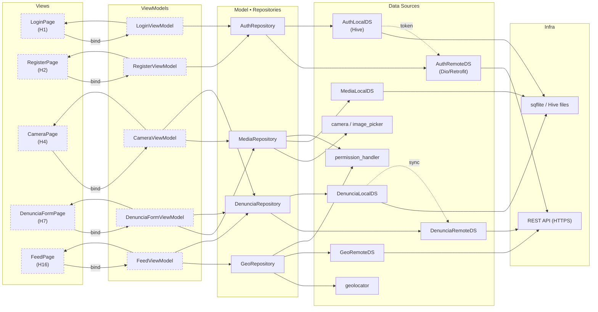

```mermaid
  flowchart LR
    %% ========== VIEWS ==========
    subgraph "Views"
      direction TB
      LoginPage["LoginPage\n(H1)"]
      RegisterPage["RegisterPage\n(H2)"]
      CameraPage["CameraPage\n(H4)"]
      DenunciaFormPage["DenunciaFormPage\n(H7)"]
      FeedPage["FeedPage\n(H16)"]
    end
  
    %% ========== VIEWMODELS ==========
    subgraph "ViewModels"
      direction TB
      LoginVM["LoginViewModel"]
      RegisterVM["RegisterViewModel"]
      CameraVM["CameraViewModel"]
      DenunciaFormVM["DenunciaFormViewModel"]
      FeedVM["FeedViewModel"]
    end
  
    %% ========== MODEL (Repositories) ==========
    subgraph "Model • Repositories"
      direction TB
      AuthRepo["AuthRepository"]
      DenunciaRepo["DenunciaRepository"]
      MediaRepo["MediaRepository"]
      GeoRepo["GeoRepository"]
    end
  
    %% ========== DATA SOURCES ==========
    subgraph "Data Sources"
      direction TB
      %% Remote
      AuthRemote["AuthRemoteDS\n(Dio/Retrofit)"]
      DenRemote["DenunciaRemoteDS"]
      GeoRemote["GeoRemoteDS"]
      %% Local
      AuthLocal["AuthLocalDS\n(Hive)"]
      DenLocal["DenunciaLocalDS"]
      MediaLocal["MediaLocalDS"]
      %% Plugins
      CameraPlugin["camera / image_picker"]
      GPSPlugin["geolocator"]
      PermPlugin["permission_handler"]
    end
  
    %% ========== INFRA ==========
    subgraph Infra
      direction TB
      RemoteAPI["REST API (HTTPS)"]
      LocalDB["sqflite / Hive files"]
    end
  
    %% ------- BINDINGS View ↔ VM (reativo) -------
    classDef bind stroke-dasharray:4 4
    LoginPage --bind--> LoginVM:::bind
    RegisterPage --bind--> RegisterVM:::bind
    CameraPage --bind--> CameraVM:::bind
    DenunciaFormPage --bind--> DenunciaFormVM:::bind
    FeedPage --bind--> FeedVM:::bind
    LoginVM --> LoginPage:::bind
    RegisterVM --> RegisterPage:::bind
    CameraVM --> CameraPage:::bind
    DenunciaFormVM --> DenunciaFormPage:::bind
    FeedVM --> FeedPage:::bind
  
    %% ------- VM → Repositories -------
    LoginVM --> AuthRepo
    RegisterVM --> AuthRepo
    CameraVM --> MediaRepo
    CameraVM --> DenunciaRepo
    DenunciaFormVM --> MediaRepo
    DenunciaFormVM --> DenunciaRepo
    FeedVM --> GeoRepo
    FeedVM --> DenunciaRepo
  
    %% ------- Repositories → DataSources -------
    AuthRepo --> AuthRemote
    AuthRepo --> AuthLocal
  
    DenunciaRepo --> DenRemote
    DenunciaRepo --> DenLocal
  
    MediaRepo --> CameraPlugin
    MediaRepo --> MediaLocal
    MediaRepo --> PermPlugin
  
    GeoRepo --> GPSPlugin
    GeoRepo --> GeoRemote
    GeoRepo --> PermPlugin
  
    %% ------- DataSources → Infra -------
    AuthRemote --> RemoteAPI
    DenRemote --> RemoteAPI
    GeoRemote --> RemoteAPI
    AuthLocal --> LocalDB
    DenLocal --> LocalDB
    MediaLocal --> LocalDB
  
    %% ------- Offline sync / token refresh -------
    DenLocal -.sync.-> DenRemote
    AuthLocal -.token.-> AuthRemote

```
