```mermaid

    classDiagram
        %% VIEWS (Flutter Widgets)
        class LoginPage {
            -GlobalKey formKey
            -TextEditingController emailController
            -TextEditingController passwordController
            +Widget build()
            +void onLogin()
            +bool validateForm()
        }
        
        class RegisterPage {
            -GlobalKey formKey
            -TextEditingController nomeController
            -TextEditingController emailController
            -TextEditingController passwordController
            -TextEditingController confirmPasswordController
            +Widget build()
            +void onRegister()
            +bool validateForm()
        }
        
        class CameraPage {
            -CameraController cameraController
            -List capturedMedia
            +Widget build()
            +void initCamera()
            +void capturePhoto()
        }
        
        class DenunciaFormPage {
            -GlobalKey formKey
            -TextEditingController tituloController
            -TextEditingController descricaoController
            -TextEditingController categoriaController
            -List mediaFiles
            +Widget build()
            +void onSubmit()
            +void addMedia()
        }
        
        class FeedPage {
            -List denuncias
            -bool isLoading
            -Location currentLocation
            +Widget build()
            +void loadDenuncias()
            +void refreshFeed()
        }
        
        %% VIEWMODELS (Provider/Riverpod)
        class LoginViewModel {
            -bool isLoading
            -String errorMessage
            -AuthRepository authRepository
            +Future login()
            +void logout()
            +bool validateCredentials()
        }
        
        class RegisterViewModel {
            -bool isLoading
            -String errorMessage
            -AuthRepository authRepository
            +Future register()
            +bool validateUser()
        }
        
        class CameraViewModel {
            -MediaRepository mediaRepository
            -List capturedFiles
            +Future capturePhoto()
            +Future saveMedia()
        }
        
        class DenunciaFormViewModel {
            -DenunciaRepository denunciaRepository
            -MediaRepository mediaRepository
            -Map formData
            -bool isSubmitting
            +Future submitDenuncia()
            +void addMedia()
            +bool validateForm()
        }
        
        class FeedViewModel {
            -DenunciaRepository denunciaRepository
            -GeoRepository geoRepository
            -List denuncias
            -bool isLoading
            +Future loadFeed()
            +Future refreshDenuncias()
            +Future filterByLocation()
        }
        
        %% REPOSITORIES
        class AuthRepository {
            -AuthRemoteDS authRemoteDS
            -AuthLocalDS authLocalDS
            -User currentUser
            +Future login()
            +Future register()
            +void logout()
            +User getStoredUser()
        }
        
        class DenunciaRepository {
            -DenunciaRemoteDS denunciaRemoteDS
            -DenunciaLocalDS denunciaLocalDS
            +Future submitDenuncia()
            +Future getDenuncias()
            +Future syncOfflineData()
        }
        
        class MediaRepository {
            -MediaLocalDS mediaLocalDS
            -Plugin cameraPlugin
            -Plugin permissionPlugin
            +Future capturePhoto()
            +Future saveMedia()
            +Future requestPermissions()
        }
        
        class GeoRepository {
            -GeoRemoteDS geoRemoteDS
            -Plugin gpsPlugin
            -Plugin permissionPlugin
            +Future getCurrentLocation()
            +Future getNearbyDenuncias()
            +Future requestLocationPermission()
        }
        
        %% DATA SOURCES REMOTE
        class AuthRemoteDS {
            -Dio dio
            -String baseUrl
            -String apiKey
            +Future login()
            +Future register()
            +Future refreshToken()
        }
        
        class DenunciaRemoteDS {
            -Dio dio
            -String baseUrl
            +Future postDenuncia()
            +Future getDenuncias()
            +Future uploadMedia()
        }
        
        class GeoRemoteDS {
            -Dio dio
            -String baseUrl
            +Future getNearbyDenuncias()
            +Future reverseGeocode()
        }
        
        %% DATA SOURCES LOCAL
        class AuthLocalDS {
            -Box hiveBox
            -User currentUser
            +void saveUser()
            +User getUser()
            +void clearUser()
        }
        
        class DenunciaLocalDS {
            -Database database
            -String tableName
            +Future saveDenuncia()
            +Future getDenuncias()
            +Future syncPendingDenuncias()
        }
        
        class MediaLocalDS {
            -Storage storage
            -String mediaPath
            +Future saveMedia()
            +Future getMedia()
            +Future deleteMedia()
        }
        
        %% EXTERNAL CLASSES
        class APIREST {
            <<external>>
            +endpoints
        }
        
        class LocalDatabase {
            <<external>>
            +tables
        }
        
        %% RELATIONSHIPS - VIEWS -> VIEWMODELS (Composition)
        LoginPage *-- LoginViewModel : "1..1"
        RegisterPage *-- RegisterViewModel : "1..1"
        CameraPage *-- CameraViewModel : "1..1"
        DenunciaFormPage *-- DenunciaFormViewModel : "1..1"
        FeedPage *-- FeedViewModel : "1..1"
        
        %% RELATIONSHIPS - VIEWMODELS -> REPOSITORIES (Dependency/Aggregation)
        LoginViewModel o-- AuthRepository : "uses"
        RegisterViewModel o-- AuthRepository : "uses"
        CameraViewModel o-- MediaRepository : "uses"
        DenunciaFormViewModel o-- DenunciaRepository : "uses"
        DenunciaFormViewModel o-- MediaRepository : "uses"
        FeedViewModel o-- DenunciaRepository : "uses"
        FeedViewModel o-- GeoRepository : "uses"
        
        %% RELATIONSHIPS - REPOSITORIES -> DATA SOURCES (Dependency/Aggregation)
        AuthRepository o-- AuthRemoteDS : "uses"
        AuthRepository o-- AuthLocalDS : "uses"
        DenunciaRepository o-- DenunciaRemoteDS : "uses"
        DenunciaRepository o-- DenunciaLocalDS : "uses"
        MediaRepository o-- MediaLocalDS : "uses"
        GeoRepository o-- GeoRemoteDS : "uses"
        
        %% RELATIONSHIPS - DATA SOURCES -> EXTERNAL
        AuthRemoteDS --> APIREST : "connects to"
        DenunciaRemoteDS --> APIREST : "connects to"
        GeoRemoteDS --> APIREST : "connects to"
        AuthLocalDS --> LocalDatabase : "connects to"
        DenunciaLocalDS --> LocalDatabase : "connects to"
        MediaLocalDS --> LocalDatabase : "connects to"


```

# Diagrama de Classes - Sistema de Denúncias

Este repositório contém o diagrama de classes UML do sistema de denúncias, desenvolvido com base no padrão **MVVM** e utilizando o **Repository Pattern** em um aplicativo Flutter. O diagrama foi criado no formato **Mermaid**, facilitando a visualização e alterações.

## 🗂 Estrutura do Sistema

O sistema é dividido em várias camadas, cada uma com responsabilidades bem definidas:

### 1. **Views (Flutter Widgets)**

Componentes responsáveis pela interface gráfica, como:

- **LoginPage**, **RegisterPage**, **FeedPage**, entre outros.
- Incluem atributos como controladores de formulário e métodos para construir interfaces e gerenciar interações.

### 2. **ViewModels (Provider/Riverpod)**

Intermediários que gerenciam a lógica de apresentação e o estado, como:

- Exemplo: **LoginViewModel**, **FeedViewModel**.
- Abstraem a comunicação entre as Views e os Repositórios.

### 3. **Repositories**

Camada que fornece acesso aos dados, centralizando as operações de fontes remotas e locais:

- **AuthRepository**, **DenunciaRepository**, **MediaRepository**, e **GeoRepository**.

### 4. **Data Sources**

Responsáveis por conectar-se a APIs externas ou bancos de dados locais:

- **Remotos**: **AuthRemoteDS**, **DenunciaRemoteDS**, **GeoRemoteDS**.
- **Locais**: **AuthLocalDS**, **DenunciaLocalDS**, **MediaLocalDS**.

### 5. **Classes Externas**

- **API REST**: Interface de comunicação com servidores remotos.
- **Banco Local**: Representação do armazenamento local (SQLite, Hive).

## 🔄 Relações no Sistema

- As **Views** possuem composição com os **ViewModels**.
- Os **ViewModels** têm dependências dos **Repositories**.
- Os **Repositories** se comunicam com os **Data Sources** para acessar informações locais e remotas.
- Fontes de dados remotas se conectam a APIs REST, enquanto fontes locais interagem com bancos de dados.

## 🚀 Padrões Adotados

- **MVVM (Model-View-ViewModel)**: Para separação de responsabilidades.
- **Repository Pattern**: Abstração de acesso aos dados.
- **Dependency Injection**: Modularidade e testabilidade.
